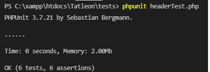
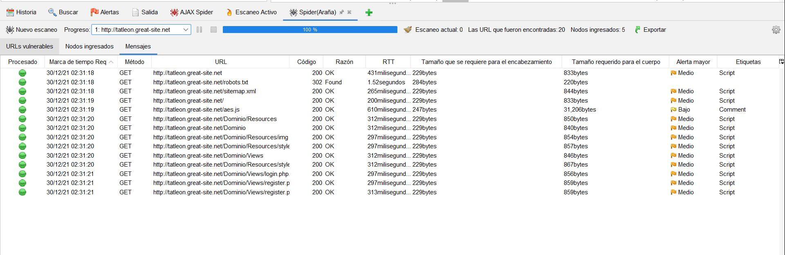

***

## Integrantes
* Jack Christopher Huaihua Huayhua
* Rodrigo Jesus Santisteban Pachari
* Angel Tomas Concha Layme
* Yober Maycol Mendoza Surco
* Gabriela ángel chipana Perez
* Juan Diego Valdivia Mendoza

***
***

## Pipeline

### Fases:
#### BUILD
Se usó COMPOSER para la construcción automática del proyecto, su archivo de configuración correspondiente es el composer.json

#### ANALYSIS
Se usó la herramienta SONARQUBE para el análisis estático del codigo, su archivo de configuración correspondiente es el sonar-project.properties y almacena los resultados en la carpeta .scannerwork

#### UNIT TEST
Se usó el framework PHPUNIT para las pruebas unitarias de los bloques de codigo, un archivo .php para cada prueba y un archivo tester.py  para el almacenamiento de los resultados de todos las pruebas en un archivo results.txt

#### PERFORMANCE TEST
Se usó la herramienta  JMeter para poner a prueba el desenvolvimiento de la aplicación web en diversas situaciones, el archivo de configuración es un archivo .jmx y los resultados se almacenan en un archivo .jtl

#### DEPLOYMENT
Se usó la herramienta NcFTP con protocolo FTP para el despliegue de aplicaciones web en los servidores. Se ejecutaron comandos en lenguaje Batch para desplegar cada uno de las subcarpetas y archivos del proyecto.

### Código
```
pipeline {
    agent any
    stages {

        stage('build') {
            steps {
                echo "Running ${env.BUILD_ID} ${env.BUILD_DISPLAY_NAME} on ${env.NODE_NAME} and JOB ${env.JOB_NAME}"
                echo pwd()
                dir('C:/xampp/htdocs/Tatleon') { 
                    bat "composer update"
                }
            }
        }


        stage('analysis')
        {
            steps{
                dir ('C:/sonarqube/bin/windows-x86-64'){
                    bat "StartSonar.bat"
                    bat "exit"
                }
                dir('C:/xampp/htdocs/Tatleon') { 
                    bat 'sonar-scanner.bat -D"sonar.projectKey=TatleonWeb" -D"sonar.sources=." -D"sonar.host.url=http://localhost:9000" -D"sonar.login=2d3ee2a973f3a1abfcfd5f2743b43d18d5c843f6"'
                }
            }
        }


        stage('unit test') {
            steps {
                echo "Running ${env.BUILD_ID} ${env.BUILD_DISPLAY_NAME} on ${env.NODE_NAME} and JOB ${env.JOB_NAME}"
                echo pwd()
                dir('C:/xampp/htdocs/Tatleon/tests') { 
                    // userGetAttributeTest and get result of tester.py
                    bat "phpunit userGetAttributeTest.php > temp.txt"
                    bat "python tester.py"
                    // headerTest and get result of tester.py
                    bat "phpunit headerTest.php > temp.txt"
                    bat "python tester.py"
                    // userGetFullNameTest and get result of tester.py
                    bat "phpunit userGetFullNameTest.php > temp.txt"
                    bat "python tester.py"
                    //read file results.txt
                    bat "type results.txt"
                    // delete file temp.txt
                    bat "del temp.txt"
                }
            }
        }


        stage('performance test') {
            steps{
                dir('C:/apache-jmeter-5.4.1/bin') {
                    bat 'jmeter -n -t C:/xampp/htdocs/Tatleon/tests/tatleon.jmx -l C:/xampp/htdocs/Tatleon/tests/tatleon.jtl'
                    bat 'more "C:/xampp/htdocs/Tatleon/tests/tatleon.jtl"'
                }
            }
        }


        stage('deployment') {
            steps {
                echo "Running ${env.BUILD_ID} ${env.BUILD_DISPLAY_NAME} on ${env.NODE_NAME} and JOB ${env.JOB_NAME}"
                echo pwd()
                dir('C:/xampp/htdocs/Tatleon') { 
                    bat "git_manager.bat"
                    bat "for /D %s in (.\*) do @ ncftpput -R -v -u \"usuario\" -p \"contraseña\" ftpupload.net /htdocs %s"
                    bat "for %%f in (.\\*) do @ncftpput -R -v -u \"usuario\" -p \"contraseña\" ftpupload.net /htdocs %%f"
                }
            }
        }
    }
}
```


## Análisis con SonarQube


## Refactoring code

### Bad smells in code
> resources/js/register.js
```php
var  nombres = $("#name");
var  apellidos = $("#last_name");
// var escuela = $("#school");
```
> resources/js/register.js
```php
else  
 {
	 alertify.alert("No se pudo completar el proceso.");
	 // alertify.alert(data);
```
> resources/js/register.js

```php
  return false;
  }
  // else if (escuela.val() == "null") 
  // {
  //     var op = alertify.alert("Debe seleccionar una escuela.");
  //     return false;
  // }
  else  if (correo_electronico.val() == "")
```
***


### Duplicate code
>resources/js/verification.js
```php
function formEsValido() 
{
    var codigo = $("#verification_code");
    var user_name = $("#username");
    if (codigo.val() == "") 
    {
        var op = alertify.alert("Debe colocar su codigo de verificacion.");
        return false;
    }
    else if (user_name.val() == "") 
    {
        var op = alertify.alert("Debe haberse registrado previamente.");
        return false;
    }

    return true;
}
```
**Corrección**
```php
function formEsValido() 
{
    var codigo = $("#verification_code");
    var user_name = $("#username");
    let op;
    if (codigo.val() == "") 
    {
        op = alertify.alert("Debe colocar su codigo de verificacion.");
        return false;
    }
    else if (user_name.val() == "") 
    {
        op = alertify.alert("Debe haberse registrado previamente.");
        return false;
    }

    return true;
}
```


### Simplifying Conditional Expressions
> index.php

```php
if (isset($_GET['logout']))
{
	if ($_GET['logout'] == "true")
	{
	session_destroy();
	header("Location: index.php");
	}
}
```
**Corrección**

```php
if (isset($_GET['logout']) && ($_GET['logout'] == "true"))
{
	session_destroy();
	header("Location: index.php");
}
```

### Declaration to make it explicit.

```php
$(document).ready(function() 
{
	$("#submit_button").click(function() 
	{
		if (formEsValido()) 
		{
			cadena = $("#login_form").serialize();
```

**Corrección**


```php
$(document).ready(function() 
{
	$("#submit_button").click(function() 
	{
		if (formEsValido()) 
		{
			let cadena = $("#login_form").serialize();
```

### Making Method Calls Simpler

> resources/views/*.php
```php
<?php  print_header('Agregar enlace', '../css/login.css', '../js/add_link.js', '../../public/favicon.ico'); ?>
```
**Corrección**
```php
class Header{
	private $title;
	private $css_path;
	private $js_path;
	private $icon_path;

	public function __construct($title, $css_path, $js_path, $icon_path)
	{
		$this->title = $title;
		$this->css_path = $css_path;
		$this->js_path = $js_path;
		$this->icon_path = $icon_path;
	}

```

```php
$header = new Header('Agregar enlace', '../css/login.css', '../js/add_link.js', '../../public/favicon.ico');

print_header($header);
```

### Unused variable

> resources/js/register.js

```php
else  if (nombre_de_usuario.val() == "") 
{
  var  op = alertify.alert("Debe colocar su nombre de usuario.");
  
```


## Otros Code Smells


### Constant names should comply with a naming convention

>app/models/user.php

- Rename this constant "Administrador" to match the regular expression

```php
define('Administrador', 1);
define('Docente', 2);
define('Estudiante', 3);
```
### Attributes deprecated in HTML5 should not be used

>index.php

```html
<div class="container" align="center" style="padding:2%;">
```

```html
<div class="container" align="center" style="padding:2%;">
```
>resources/views/login.php

```html
<body background="../img/blue_background.jpg" style="background-size: cover">
```
```html
<div class="container" align="center">
```

 En el análisis del resto de código , se presentan **Code Smells** basados en lo mismo.


### Extra semicolons should be removed

>resources/css/login.css

```css
width: 60% !important;;
```
```css
width: 80% !important;;
```

### Variables should be declared explicitly

>resources/css/login.css

```php
cadena = $("#login_form").serialize();
```

>resources/js/register.js

```php
cadena = $("#signup_form").serialize();
```


# Casos de Prueba

## **Función** *print_header($header) :*
$header es un parámetro de tipo Header que cuenta con 4 atributos:
* private  $title;
* private  $css_path;
* private  $js_path;
* private  $icon_path;
Que son el título y la ubicación de los archivos necesarios.

| Caso de Prueba| Valor de Entrada| Resultado Esperado |
| ----------- | ----------- | ----------- |
| Solo Título | Un objeto de tipo Header que solo tenga el titulo establecido  | 1101 |
| Solo Archivo CSS | Un objeto de tipo Header que solo tenga la ubicación al Archivo CSS | 1011 |
| Solo Archivo JS | Un objeto de tipo Header que solo tenga la ubicación al Archivo JS | 111 |
| Solo Icono | Un objeto de tipo Header que solo tenga la ubicación al ícono | 1110 |
| Completo  | Un objeto de tipo Header con todos sus atributos establecidos | 0 |
| Vacio| Un objeto de tipo Header con ningún atributo establecido | 1111 |


## **Función** *getNombresCompletos()* de la clase User :

| Caso de Prueba| Valor de Entrada| Resultado Esperado |
| ----------- | ----------- | ----------- |
| Nombres y Apellidos disponibles | nombres=Jack Christopher, apellidos= Huaihua Huayhua  | Huaihua Huayhua, Jack Christopher|
| Nombres y Apellidos disponibles | nombres=Rodrigo Jesus, apellidos= Santisteban Pachari  | Santisteban Pachari, Rodrigo Jesus|
| Nombres disponibles y Apellidos no disponibles | nombres=, apellidos=  | N, N|
| Nombres no disponibles y Apellidos disponibles | nombres=, apellidos=  | N, N|
| Nombres y Apellidos no disponibles | nombres=, apellidos=  | N, N|


## **Función** *getAtributo($atributo)* de la clase User :
| Caso de Prueba| Valor de Entrada| Resultado Esperado |
| ----------- | ----------- | ----------- |
| Obtener atributo ID disponible | Usuario con id=5 | 5|
| Obtener atributo nombre disponible | Usuario con nombre=Jack Christopher | Jack Christopher |
| Obtener atributo email disponible | Usuario con email=jack@gmail.com | jack@gmail.com |
| Obtener atributo nombre de usuario disponible | Usuario con nombre de usuario=JC | JC|
| Obtener atributo no existente telefono | Usuario cualquiera | null|
| Obtener atributo no existente edad | Usuario cualquiera | null|
| Obtener atributo no existente direccion | Usuario cualquiera | null|

## **Ejecución de Test Unitarios con PHPUnit**



## **Pruebas de Performance con Jmeter**
Realizamos pruebas de performance con Jmeter en distintas funcionalidades de la plataforma, como  la visualización de recursos, docentes y enlaces, lo que nos arrojó los siguientes resultados.

* Estadísticas de cada prueba

* Errores encontrados


## **Pruebas funcionales con Selenium**
Se realizaron test funcionales con la herramienta de Selenium para la validación de emails, para lo cual se realizaron algunos tests
```
def test1(self): 
        email = "rsan@unsa.edu.pe"
        esperado = check(email)
        print("TEST 1", email)
        self.assertEqual(WebTester(email), esperado)
    def test2(self): 
        email = "asd"
        esperado = check(email)
        print("TEST 2", email)
        self.assertEqual(WebTester(email), esperado)
    def test3(self): 
        email = "correo@gmail.com"
        esperado = check(email)
        print("TEST 3", email)
        self.assertEqual(WebTester(email), esperado)
    def test4(self): 
        email = "esarmiento@unsa.edu.pe"
        esperado = check(email)
        print("TEST 4: ", email)
        self.assertEqual(WebTester(email), esperado)
```
## **Pruebas de seguridad con OWASP**
Se realizaron las pruebas de seguridad usando Owasp habiendo subido el proyecto a la nube y estos fueron los resultados obtenidos:

Escaneo activo:

Alertas:

URLS vulnerables [Spider Araña]:

Mensajes [Spider Araña]:

Ajax Spider:


